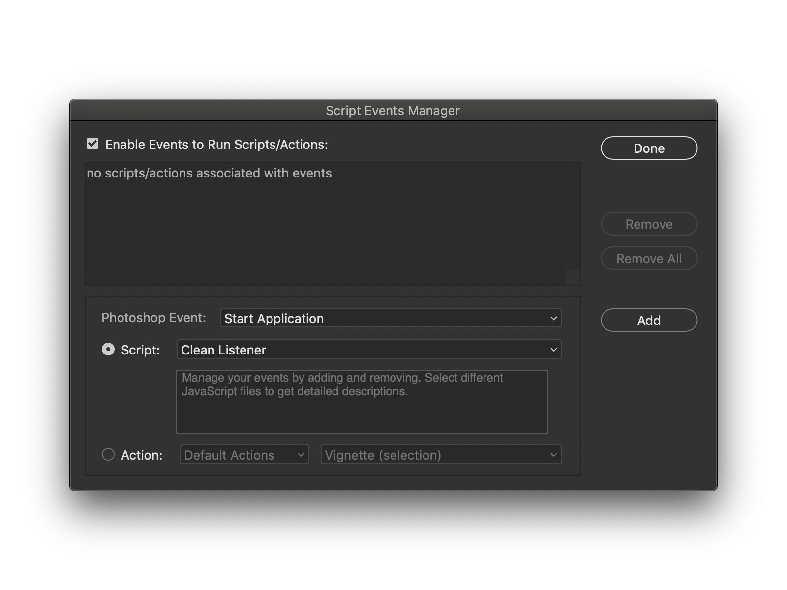
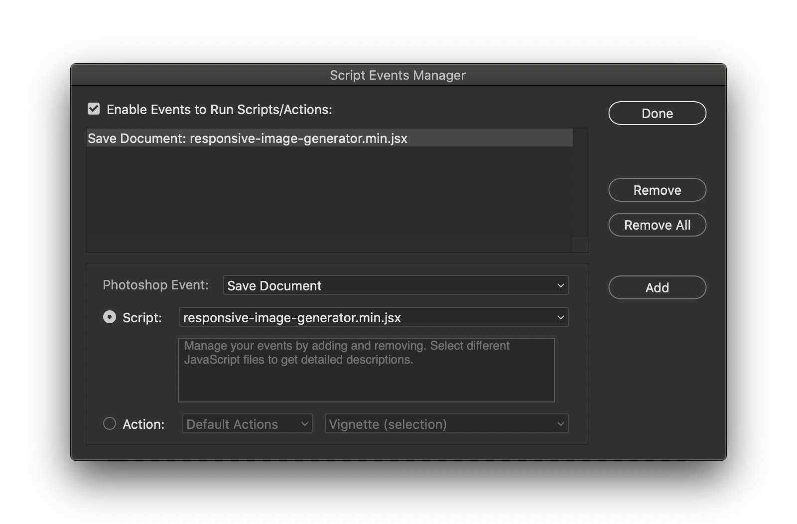
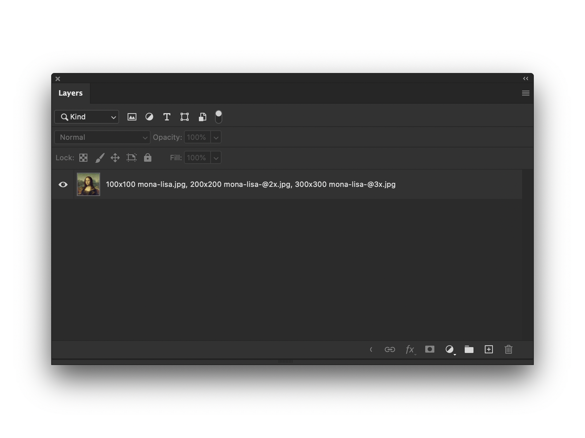
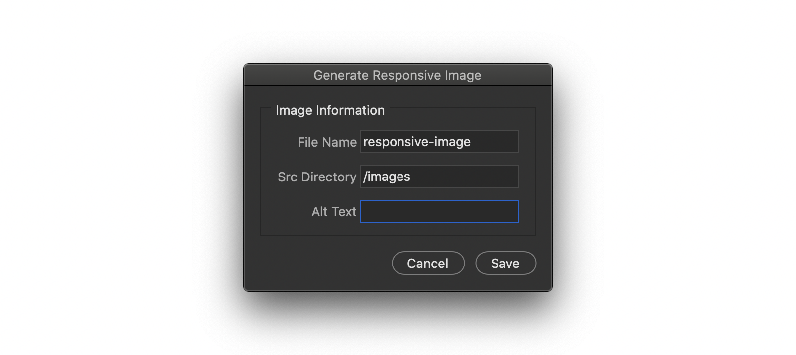
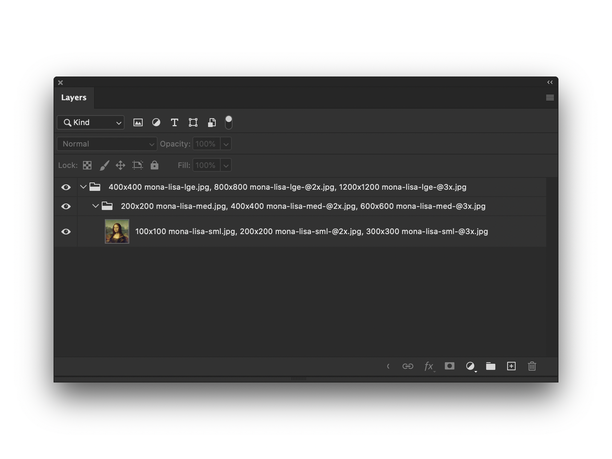
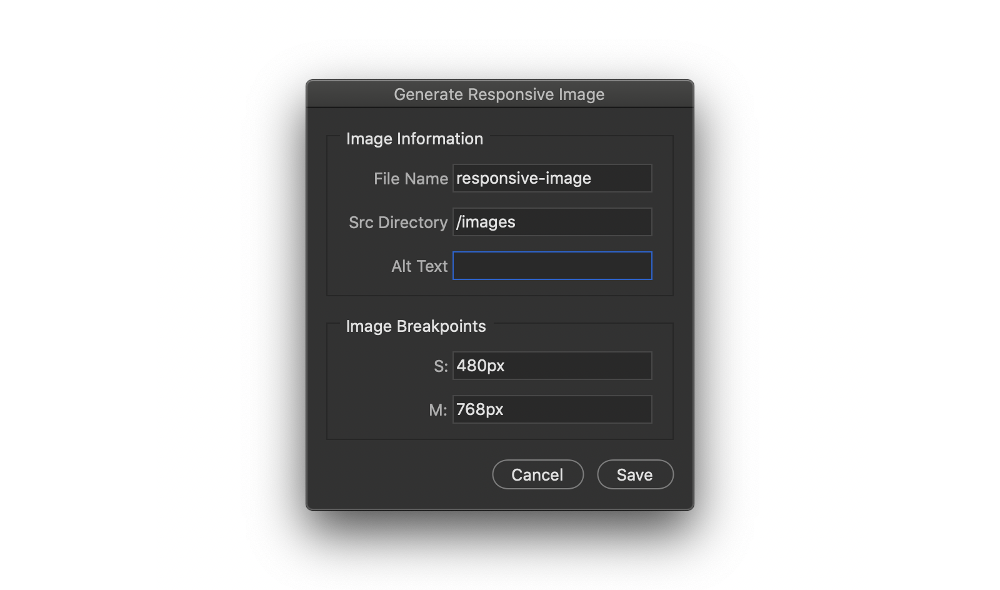

# Responsive Image Generator

A plugin to extend Adobe® Photoshop's [Generate Image Assets](https://helpx.adobe.com/au/photoshop/using/generate-assets-layers.html) feature.

Responsive Image Generator creates HTML snippets from the asset names in your Photoshop document, so that you don't have to.

## Installation

1. Download the [Responsive Image Generator](https://raw.githubusercontent.com/DanMad/responsive-image-generator/master/dist/responsive-image-generator.min.jsx).
2. Add the downloaded script to Photoshop's `Scripts` directory. The path to this directory is as follows:

   - Mac OS: `Macintosh HD/Applications/Adobe Photoshop 2020/Presets/Scripts`
   - Windows: `C:\Program Files\Adobe\Adobe Photoshop 2020\Presets\Scripts`

   **Note:** Paths may vary from the examples above, depending on the version of Photoshop you're running.

3. Open Photoshop and create a new, blank document (a document needs to be open to follow these next few steps).
4. Navigate to `File > Scripts > Script Events Manager`. The `Script Events Manager` dialog should appear:

   

5. Associate the `responsive-image-generator.min.jsx` script with the `Save Document` event by:

   1. Checking `Enable Events to Run Scripts/Actions`
   2. Selecting `Save Document` from the options in the `Photoshop Event` dropdown
   3. Selecting `responsive-image-generator.min.jsx` from the options in the `Script` dropdown

      **Note:** If `responsive-image-generator.min.jsx` isn't available in the `Script` dropdown, browse your file system and select it from Photoshop's `Scripts` directory.

   4. Pressing `Add`

   The dialog should now look similar to this:

   

6. Press `Done` and you're good to go!

## Usage

Once you've successfully completed the [Installation](https://github.com/DanMad/responsive-image-generator#installation) instructions, saving your documents will call the Responsive Image Generator. If a document's layers contain asset names, then the Responsive Image Generator's dialog will appear.

**Note:** The Responsive Image Generator is designed to extend Photoshop's _Generate Image Assets_ feature. Ensure that it's toggled on by checking `File > Generate > Image Assets` before saving each document you plan to generate responsive image snippets from.

### Examples

Let's say we've just finished working on a document called `mona-lisa.psd` and it contains three assets we'd like to generate; `100x100 mona-lisa.jpg`, `200x200 mona-lisa-@2x.jpg` and `300x300 mona-lisa-@3x.jpg`:



We're happy with our work, so we save our document and then the Responsive Image Generator's dialog appears, prompting us for the responsive image's `alt` text:



**Note:** The Responsive Image Generator will name your snippet consistently with your Photoshop document's name and write each image's `src` directory as `/images` by default. Configure these if necessary, to meet your own requirements.

We enter `"The Mona Lisa"` as `alt` text and press `Save`.

This results in `mona-lisa.html` being generated in the `mona-lisa-assets` directory, alongside `mona-lisa.psd`. The file will contain your responsive image snippet that you can leverage in your own projects:

```html

```

This example can be expanded on. Let's now say we need to serve different images for different contexts; `sml`, `med` and `lge`, on top of serving different images depending on the resolution. This will mean our document's layers will now include nine asset names. First we'll rename the original three so that they include a `sml` argument:

1. `100x100 mona-lisa-sml.jpg`
2. `200x200 mona-lisa-sml-@2x.jpg`
3. `300x300 mona-lisa-sml-@3x.jpg`

Then we'll group our orginal layer and include the additional six asset names with `med` and `lge` arguments within the group's name:

4. `200x200 mona-lisa-med.jpg`
5. `400x400 mona-lisa-med-@2x.jpg`
6. `600x600 mona-lisa-med-@3x.jpg`
7. `400x400 mona-lisa-lge.jpg`
8. `800x800 mona-lisa-lge-@2x.jpg`
9. `1200x1200 mona-lisa-lge-@3x.jpg`



This time, when we save our document, the Responsive Image Generator's dialog will appear with additional options so that you can also customise the responsive images breakpoints:



As with the last example, we enter `"The Mona Lisa"` as `alt` text and press `Save`.

The snippet generated in this instance leverages the `picture` and `source` elements, with `media` attributes outlining the responsive image's breakpoints:

```html
<picture>
  <source
    media="(min-width: 48.0625em)"
    srcset="
      /images/mona-lisa-lge.jpg 1x,
      /images/mona-lisa-lge-@2x.jpg 2x,
      /images/mona-lisa-lge-@3x.jpg 3x
    "
  />
  <source
    media="(min-width: 30.0625em)"
    srcset="
      /images/mona-lisa-med.jpg 1x,
      /images/mona-lisa-med-@2x.jpg 2x,
      /images/mona-lisa-med-@3x.jpg 3x
    "
  />
  
</picture>
```

## Issues

If you encounter any bugs, please [post an issue](https://github.com/DanMad/responsive-image-generator/issues/new).

## Contributing

Contributions are more than welcome. Ensure you read through the [contributing guidelines](https://github.com/DanMad/responsive-image-generator/blob/main/CONTRIBUTING.md) before submitting a pull request.
